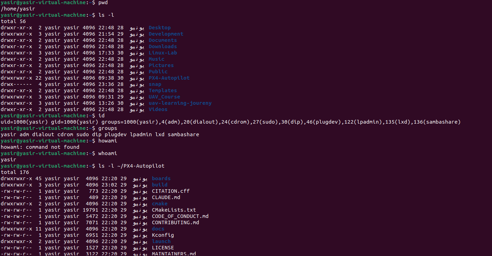

## Module 1.4: Linux Permissions & Access Control

Managing file permissions ensures that critical flight scripts, hardware ports, and simulation tools are only modified or executed by authorized users and processes.

---

### Understanding Linux Permissions

#### What are permissions?
Permissions are access rights assigned to files and directories. They dictate who can read, modify, or run a specific file on the system.

#### Why Linux uses permissions
Linux is a multi-user operating system. It uses permissions for security and stability—preventing normal users or rogue background scripts from accidentally deleting system files, modifying flight controller firmware, or altering critical hardware configurations.

---

### Core Permission Types

* **Read (`r`):** Allows viewing the contents of a file (e.g., using `cat`) or listing the files inside a directory (using `ls`).
* **Write (`w`):** Allows modifying, saving, or deleting the contents of a file, as well as creating or deleting files inside a directory.
* **Execute (`x`):** Allows running a file as a program or script (essential for drone simulation launch scripts). On directories, it allows entering them (using `cd`).

---

### User Classes

* **Owner (User):** The individual user who created the file or directory. They have primary control over its access settings.
* **Group:** A collection of users who share the same access permissions to that file, which is helpful for collaborative engineering teams.
* **Others:** Everyone else on the system who is not the owner and not part of the assigned group.

---

### Administrative Commands & Concepts

#### 1. Root
* **Concept:** The system administrator account (superuser) that has unrestricted access to read, write, or execute any file on the system.

#### 2. `sudo` (Superuser Do)
* **Purpose:** Runs a single command with administrative privileges.
* **Example:** `sudo apt update`
* **UAV Use Case:** I would use `sudo` when installing global robotics dependencies or changing system-level network configurations for video streaming.

#### 3. `id`
* **Purpose:** Displays your exact user identity details, including your User ID (UID) and Group ID (GID).
* **Example:** `id`
* **UAV Use Case:** I would use `id` to verify that my current terminal session is running with the correct user profile before launching a software stack.

#### 4. `groups`
* **Purpose:** Lists all the access groups that your user account belongs to.
* **Example:** `groups`
* **UAV Use Case:** I would use `groups` to confirm that my user account is added to the `dialout` group, which is required to read and write to serial USB ports connected to a telemetry radio.

---

### Engineering Notes: UAV & PX4 Permissions

Permissions directly impact automated systems and drone engineering work in several ways:
* **Serial Port Access:** To communicate with a physical flight controller (like a Pixhawk) via USB telemetry, your user must belong to the `dialout` group. Without it, you will get a "Permission Denied" error when trying to flash PX4 firmware or connect QGroundControl.
* **Executable Build Scripts:** When downloading PX4 or ROS installation scripts from GitHub, they often download without execution permissions. You must manually grant permission (using `chmod +x script.sh`) before you can run the setup environment.
* **Sudo Restrictions:** Running ROS or simulation build commands (like `colcon build` or `make px4_sitl`) with `sudo` is a bad practice. It locks your workspace files under `root` ownership, making it impossible to edit your source code normally without permission fixes.

---

---

### Module 1.4 Summary
Today I learned the mechanics of Linux security through permissions, user classes, and system access commands. I discovered how read, write, and execute permissions safeguard files and why understanding superuser rights with `sudo` is vital for configuring system resources safely. Connecting these concepts to UAV work highlighted how simple permission oversights like not being in the `dialout` group can block a drone's ground station connection, proving that proper access control configuration is just as critical as writing the flight code itself.
