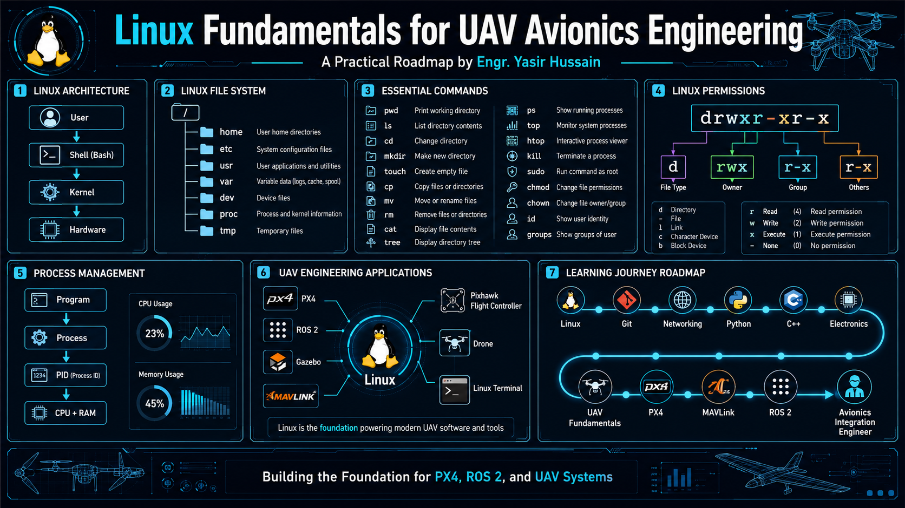
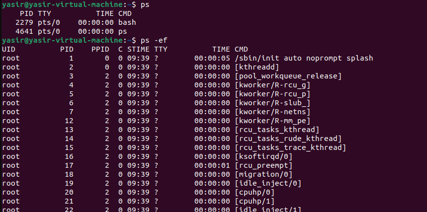
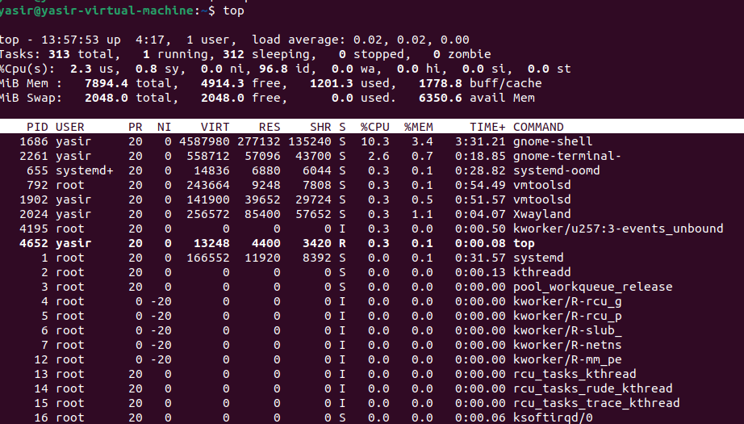
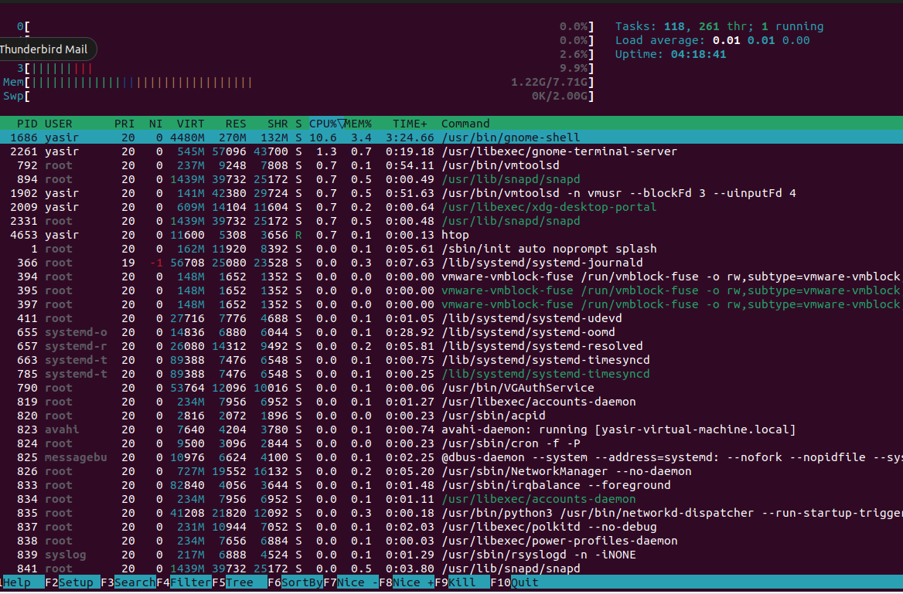

# Module 1: Linux Fundamentals

## Module 1.1: Introduction & Architecture

### What is an Operating System?
An Operating System (OS) is the software that manages a computer's hardware resources (CPU, memory, storage) and acts as an intermediary between the hardware and the applications you run.

---

### Why do UAV engineers use Linux?
UAV engineers use Linux because it is open-source, highly stable, and lightweight, allowing for deep customization on resource-constrained drone hardware. Additionally, standard robotics frameworks like **ROS**, **PX4**, **ArduPilot**, and **Gazebo** are natively built and optimized for Linux.

---

### Linux Architecture
* **Users / Applications:** The top layer where tools, scripts, and drone software run.
* **Shell (CLI):** The interface that interprets user commands and sends them to the kernel.
* **Kernel:** The core of the OS that directly controls the hardware and manages system resources.
* **Hardware:** The physical components (CPU, RAM, sensors, flight controllers).

---

### Commands Learned Today
* `pwd` – **P**rint **W**orking **D**irectory (shows your current folder path).
* `ls` – **L**i**s**t (displays files and folders in your current directory).
* `whoami` – Displays the username of the current terminal session.
* `uname -a` – Prints detailed system and Linux kernel information.
* `hostnamectl` – Shows system architecture, OS version, and device name settings.

---

### Module 1.1 Summary
Today I learned the foundational layout of an operating system and why Linux is the industry standard for UAV and robotics development. I explored the layered architecture of Linux, understanding how commands flow from the user terminal down to the physical hardware components. Finally, I gained hands-on experience using the command line to navigate the filesystem and query core system information, which is essential for future drone simulation and configuration tasks.

***

## Module 1.2: Linux File System

### What is a file system?
It is the system's digital filing cabinet. It organizes and manages how data is stored and retrieved on a drive, keeping it structured in files and folders instead of a chaotic mess of data.

### What is the root directory?
Represented by a single forward slash (`/`), the root directory is the absolute base of the entire Linux system. Everything—files, programs, and drives—stems from this single starting point.

### Difference between absolute and relative paths.
* **Absolute Path:** The full address starting from the root (e.g., `/home/user/docs`). It works no matter where you are currently working.
* **Relative Path:** A shortcut address based on your current location (e.g., `docs/file.txt` or `../photos`).

---

### Important Linux directories

| Directory | Purpose |
|-----------|---------|
| `/` | **Root:** The starting point of the entire system. |
| `/home` | **User Home:** Personal files, documents, and settings. |
| `/etc` | **Configuration:** System settings and configuration files. |
| `/usr` | **User Apps:** Programs, libraries, and shared data. |
| `/var` | **Variable Data:** Frequently changing files like system logs. |
| `/tmp` | **Temporary:** Files needed briefly, often deleted on reboot. |
| `/dev` | **Devices:** Hardware components represented as files. |
| `/proc` | **Processes:** Virtual data about running programs and the system. |

---

### Module 1.2 Summary
Today I learned that Linux organizes everything into a single, clean tree structure starting at the root (`/`) directory. I discovered that even hardware devices are treated as files inside this system. I mastered the difference between absolute paths (full addresses) and relative paths (directional shortcuts). Understanding specific folders like `/etc` for settings and `/var` for logs helped demystify how Linux stays organized under the hood. Ultimately, navigating the terminal feels much easier now that I know how the filesystem layout works.

## Module 1.3: File & Directory Manipulation

In Linux, managing files and directories efficiently is crucial for configuring flight controllers, managing build scripts, and organizing log files.

---

### File Management Commands

#### 1. `mkdir` (Make Directory)
* **Purpose:** Creates a new, empty directory.
* **Example:** `mkdir ~/uav_project`
* **UAV Use Case:** I would use `mkdir` to create a dedicated workspace folder for a new ROS 2 or PX4 simulation package.

#### 2. `rmdir` (Remove Directory)
* **Purpose:** Deletes an empty directory.
* **Example:** `rmdir ~/old_logs`
* **UAV Use Case:** I would use `rmdir` to clean up empty, unused build or export folders to keep my workspace organized.

#### 3. `touch`
* **Purpose:** Creates a new, empty file or updates the timestamp of an existing file.
* **Example:** `touch flight_params.txt`
* **UAV Use Case:** I would use `touch` to quickly create an empty configuration or checklist file before editing it with parameters.

#### 4. `cp` (Copy)
* **Purpose:** Copies files or directories from one location to another.
* **Example:** `cp config.pvh config_backup.pvh`
* **UAV Use Case:** I would use `cp` to make a backup of a PX4 configuration file before changing parameters so I can easily revert if a flight test fails.

#### 5. `mv` (Move / Rename)
* **Purpose:** Moves files or directories to a different path, or renames them.
* **Example:** `mv mission.plan current_mission.plan`
* **UAV Use Case:** I would use `mv` to move compiled binary files to the deployment folder, or to rename a waypoint mission file.

#### 6. `rm` (Remove)
* **Purpose:** Deletes files or directories (use `-r` for directories).
* **Example:** `rm temp_log.csv`
* **UAV Use Case:** I would use `rm` to permanently delete corrupted flight logs or temporary cache files to free up disk space.

#### 7. `cat` (Concatenate)
* **Purpose:** Displays the full contents of a file directly in the terminal.
* **Example:** `cat telemetry_status.log`
* **UAV Use Case:** I would use `cat` to quickly read small configuration files or verify the status messages inside a drone script.

#### 8. `tree`
* **Purpose:** Displays a visual, depth-indented tree graph of directories and files.
* **Example:** `tree ~/catkin_ws`
* **UAV Use Case:** I would use `tree` to double-check the structural layout of a ROS workspace to ensure nodes, launch files, and package configurations are in the right folders.

---

---

### Module 1.3 Summary
Today I learned how to create, copy, move, and destroy files and directories directly from the terminal. Connecting these commands to practical UAV scenarios showed me how vital command-line confidence is for managing flight parameters, structuring ROS workspaces, and safeguarding configuration backups. Visualizing the workspace layout with the `tree` command made it clear how directories interlink, which will save time when troubleshooting missing path errors in drone scripts.

## Module 1.4: Linux Permissions & Access Control

Managing file permissions ensures that critical flight scripts, hardware ports, and simulation tools are only modified or executed by authorized users and processes.

---

### Understanding Linux Permissions

#### What are permissions?
Permissions are access rights assigned to files and directories. They dictate who can read, modify, or run a specific file on the system.

#### Why Linux uses permissions
Linux is a multi-user operating system. It uses permissions for security and stability—preventing normal users or rogue background scripts from accidentally deleting system files, modifying flight controller firmware, or altering critical hardware configurations.

---

### Core Permission Types

* **Read (`r`):** Allows viewing the contents of a file (e.g., using `cat`) or listing the files inside a directory (using `ls`).
* **Write (`w`):** Allows modifying, saving, or deleting the contents of a file, as well as creating or deleting files inside a directory.
* **Execute (`x`):** Allows running a file as a program or script (essential for drone simulation launch scripts). On directories, it allows entering them (using `cd`).

---

### User Classes

* **Owner (User):** The individual user who created the file or directory. They have primary control over its access settings.
* **Group:** A collection of users who share the same access permissions to that file, which is helpful for collaborative engineering teams.
* **Others:** Everyone else on the system who is not the owner and not part of the assigned group.

---

### Administrative Commands & Concepts

#### 1. Root
* **Concept:** The system administrator account (superuser) that has unrestricted access to read, write, or execute any file on the system.

#### 2. `sudo` (Superuser Do)
* **Purpose:** Runs a single command with administrative privileges.
* **Example:** `sudo apt update`
* **UAV Use Case:** I would use `sudo` when installing global robotics dependencies or changing system-level network configurations for video streaming.

#### 3. `id`
* **Purpose:** Displays your exact user identity details, including your User ID (UID) and Group ID (GID).
* **Example:** `id`
* **UAV Use Case:** I would use `id` to verify that my current terminal session is running with the correct user profile before launching a software stack.

#### 4. `groups`
* **Purpose:** Lists all the access groups that your user account belongs to.
* **Example:** `groups`
* **UAV Use Case:** I would use `groups` to confirm that my user account is added to the `dialout` group, which is required to read and write to serial USB ports connected to a telemetry radio.

---

### Engineering Notes: UAV & PX4 Permissions

Permissions directly impact automated systems and drone engineering work in several ways:
* **Serial Port Access:** To communicate with a physical flight controller (like a Pixhawk) via USB telemetry, your user must belong to the `dialout` group. Without it, you will get a "Permission Denied" error when trying to flash PX4 firmware or connect QGroundControl.
* **Executable Build Scripts:** When downloading PX4 or ROS installation scripts from GitHub, they often download without execution permissions. You must manually grant permission (using `chmod +x script.sh`) before you can run the setup environment.
* **Sudo Restrictions:** Running ROS or simulation build commands (like `colcon build` or `make px4_sitl`) with `sudo` is a bad practice. It locks your workspace files under `root` ownership, making it impossible to edit your source code normally without permission fixes.

---

---

### Module 1.4 Summary
Today I learned the mechanics of Linux security through permissions, user classes, and system access commands. I discovered how read, write, and execute permissions safeguard files and why understanding superuser rights with `sudo` is vital for configuring system resources safely. Connecting these concepts to UAV work highlighted how simple permission oversights—like not being in the `dialout` group—can block a drone's ground station connection, proving that proper access control configuration is just as critical as writing the flight code itself.

## Module 1.5: Linux Process Management

Monitoring and controlling processes ensures that resource-intensive drone software stacks, flight controllers, and video telemetry pipelines run smoothly without locking up the onboard computer.

---

### Core Process Concepts

#### What is a process?
A process is an active, executing instance of a program loaded into the system's memory. Whenever you open a terminal, run a simulation, or launch a script, Linux creates a process to handle it.

#### Difference between a program and a process
* **Program:** A passive, static set of instructions stored on your storage drive (e.g., the compiled `px4` software file). It does nothing on its own.
* **Process:** An active, dynamic entity loaded into RAM that actively uses CPU resources, memory, and system devices to execute those instructions.

#### What is a PID?
A PID (Process ID) is a unique numerical identifier assigned by the Linux kernel to every running process. The system uses this number to track resource consumption, manage permissions, and target specific tasks when pausing or stopping them.

---

### Process Monitoring Commands

#### 1. `ps` (Process Status)
* **Purpose:** Displays a snapshot of the currently active processes running in your current terminal session. 
* **Key Flag:** Using `ps -ef` lists every single process running across the entire system, showing the UID, PID, Parent PID (PPID), and command path.
* **UAV Use Case:** I would use `ps -ef | grep ros` to verify whether background ROS 2 nodes are hidden or still running after shutting down a simulation workspace.

#### 2. `top` vs `htop`
* **`top`:** The default, text-based system monitor built into almost all Linux systems. It displays a real-time, frequently updated list of active processes sorted by CPU usage, but lacks color and mouse support.
* **`htop`:** An interactive, visually enhanced process viewer. It features color-coded bar graphs for CPU and RAM usage per core, supports mouse clicks, and allows you to easily search, filter, and sort tasks without typing flags.

#### 3. `kill`
* **Purpose:** Sends a termination signal to a process using its PID, forcing it to close down.
* **Example:** `kill -9 1234` (Forces process 1234 to stop immediately).
* **UAV Use Case:** I would use `kill` to forcefully shut down a frozen Gazebo simulation process that is locking up CPU resources before trying to restart a flight simulation.

---

### Engineering Notes: Process Monitoring in UAV Projects

Onboard an autonomous drone (e.g., using a Raspberry Pi or NVIDIA Jetson companion computer), process management directly prevents mission critical failures:
* **Resource Bottlenecks:** Real-time software like object detection networks or visual-inertial odometry (VIO) nodes can spike CPU consumption. Using `htop` helps pinpoint if a vision node is starving a critical obstacle avoidance script of processing power.
* **Ghost Processes:** Sometimes, when a drone simulation script crashes or is terminated incorrectly, the underlying physics engine (`gzserver` or `gazebo`) continues running invisibly in the background. If you don't find its PID with `ps` and terminate it with `kill`, the next simulation run will fail due to conflicting port and hardware access.

---

### Module 1.5 Summary
Today I learned how the Linux operating system manages active tasks using processes and unique Process IDs (PIDs). I explored how to get a quick snapshot of running tasks using `ps` and compared the classic layout of `top` with the interactive, color-coded dashboard of `htop` for live resource tracking. Understanding how to selectively manage these tasks with the `kill` command is highly practical for drone development, ensuring that locked background tasks or runaway vision scripts can be cleanly terminated to maintain reliable companion computer stability.
