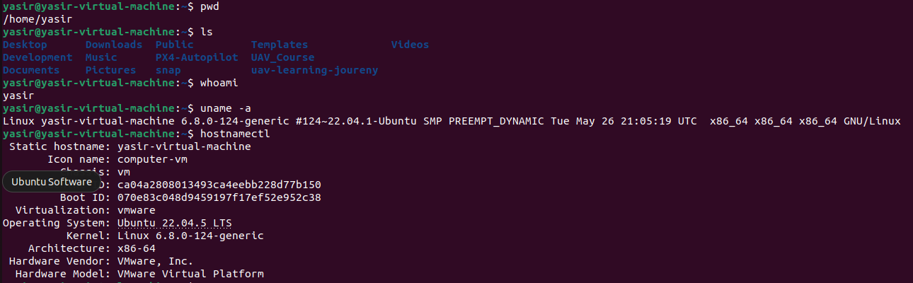
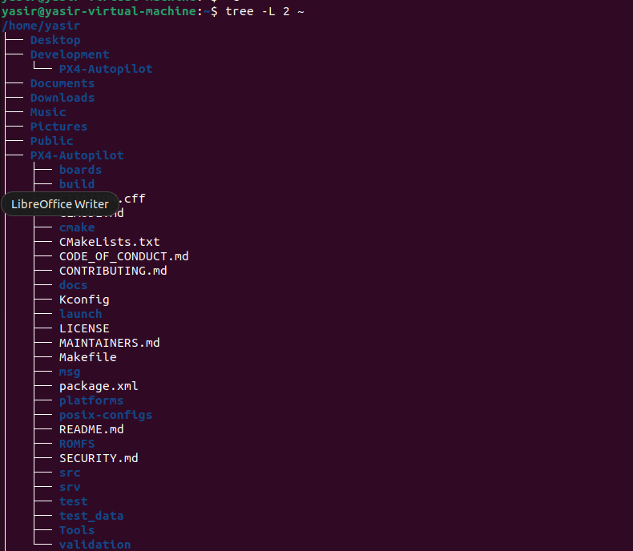
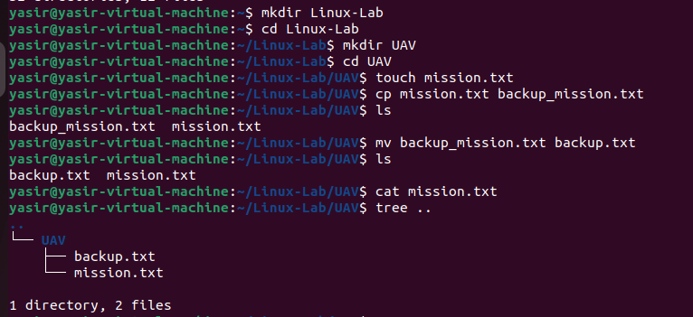

# Module 1: Linux Fundamentals

## Module 1.1: Introduction & Architecture

### What is an Operating System?
An Operating System (OS) is the software that manages a computer's hardware resources (CPU, memory, storage) and acts as an intermediary between the hardware and the applications you run.

---

### Why do UAV engineers use Linux?
UAV engineers use Linux because it is open-source, highly stable, and lightweight, allowing for deep customization on resource-constrained drone hardware. Additionally, standard robotics frameworks like **ROS**, **PX4**, **ArduPilot**, and **Gazebo** are natively built and optimized for Linux.

---

### Linux Architecture
* **Users / Applications:** The top layer where tools, scripts, and drone software run.
* **Shell (CLI):** The interface that interprets user commands and sends them to the kernel.
* **Kernel:** The core of the OS that directly controls the hardware and manages system resources.
* **Hardware:** The physical components (CPU, RAM, sensors, flight controllers).

---

### Commands Learned Today
* `pwd` – **P**rint **W**orking **D**irectory (shows your current folder path).
* `ls` – **L**i**s**t (displays files and folders in your current directory).
* `whoami` – Displays the username of the current terminal session.
* `uname -a` – Prints detailed system and Linux kernel information.
* `hostnamectl` – Shows system architecture, OS version, and device name settings.

---

### Module 1.1 Summary
Today I learned the foundational layout of an operating system and why Linux is the industry standard for UAV and robotics development. I explored the layered architecture of Linux, understanding how commands flow from the user terminal down to the physical hardware components. Finally, I gained hands-on experience using the command line to navigate the filesystem and query core system information, which is essential for future drone simulation and configuration tasks.

***

## Module 1.2: Linux File System

### What is a file system?
It is the system's digital filing cabinet. It organizes and manages how data is stored and retrieved on a drive, keeping it structured in files and folders instead of a chaotic mess of data.

### What is the root directory?
Represented by a single forward slash (`/`), the root directory is the absolute base of the entire Linux system. Everything—files, programs, and drives—stems from this single starting point.

### Difference between absolute and relative paths.
* **Absolute Path:** The full address starting from the root (e.g., `/home/user/docs`). It works no matter where you are currently working.
* **Relative Path:** A shortcut address based on your current location (e.g., `docs/file.txt` or `../photos`).

---

### Important Linux directories

| Directory | Purpose |
|-----------|---------|
| `/` | **Root:** The starting point of the entire system. |
| `/home` | **User Home:** Personal files, documents, and settings. |
| `/etc` | **Configuration:** System settings and configuration files. |
| `/usr` | **User Apps:** Programs, libraries, and shared data. |
| `/var` | **Variable Data:** Frequently changing files like system logs. |
| `/tmp` | **Temporary:** Files needed briefly, often deleted on reboot. |
| `/dev` | **Devices:** Hardware components represented as files. |
| `/proc` | **Processes:** Virtual data about running programs and the system. |

---

### Module 1.2 Summary
Today I learned that Linux organizes everything into a single, clean tree structure starting at the root (`/`) directory. I discovered that even hardware devices are treated as files inside this system. I mastered the difference between absolute paths (full addresses) and relative paths (directional shortcuts). Understanding specific folders like `/etc` for settings and `/var` for logs helped demystify how Linux stays organized under the hood. Ultimately, navigating the terminal feels much easier now that I know how the filesystem layout works.

## Module 1.3: File & Directory Manipulation

In Linux, managing files and directories efficiently is crucial for configuring flight controllers, managing build scripts, and organizing log files.

---

### File Management Commands

#### 1. `mkdir` (Make Directory)
* **Purpose:** Creates a new, empty directory.
* **Example:** `mkdir ~/uav_project`
* **UAV Use Case:** I would use `mkdir` to create a dedicated workspace folder for a new ROS 2 or PX4 simulation package.

#### 2. `rmdir` (Remove Directory)
* **Purpose:** Deletes an empty directory.
* **Example:** `rmdir ~/old_logs`
* **UAV Use Case:** I would use `rmdir` to clean up empty, unused build or export folders to keep my workspace organized.

#### 3. `touch`
* **Purpose:** Creates a new, empty file or updates the timestamp of an existing file.
* **Example:** `touch flight_params.txt`
* **UAV Use Case:** I would use `touch` to quickly create an empty configuration or checklist file before editing it with parameters.

#### 4. `cp` (Copy)
* **Purpose:** Copies files or directories from one location to another.
* **Example:** `cp config.pvh config_backup.pvh`
* **UAV Use Case:** I would use `cp` to make a backup of a PX4 configuration file before changing parameters so I can easily revert if a flight test fails.

#### 5. `mv` (Move / Rename)
* **Purpose:** Moves files or directories to a different path, or renames them.
* **Example:** `mv mission.plan current_mission.plan`
* **UAV Use Case:** I would use `mv` to move compiled binary files to the deployment folder, or to rename a waypoint mission file.

#### 6. `rm` (Remove)
* **Purpose:** Deletes files or directories (use `-r` for directories).
* **Example:** `rm temp_log.csv`
* **UAV Use Case:** I would use `rm` to permanently delete corrupted flight logs or temporary cache files to free up disk space.

#### 7. `cat` (Concatenate)
* **Purpose:** Displays the full contents of a file directly in the terminal.
* **Example:** `cat telemetry_status.log`
* **UAV Use Case:** I would use `cat` to quickly read small configuration files or verify the status messages inside a drone script.

#### 8. `tree`
* **Purpose:** Displays a visual, depth-indented tree graph of directories and files.
* **Example:** `tree ~/catkin_ws`
* **UAV Use Case:** I would use `tree` to double-check the structural layout of a ROS workspace to ensure nodes, launch files, and package configurations are in the right folders.

---

---

### Module 1.3 Summary
Today I learned how to create, copy, move, and destroy files and directories directly from the terminal. Connecting these commands to practical UAV scenarios showed me how vital command-line confidence is for managing flight parameters, structuring ROS workspaces, and safeguarding configuration backups. Visualizing the workspace layout with the `tree` command made it clear how directories interlink, which will save time when troubleshooting missing path errors in drone scripts.
