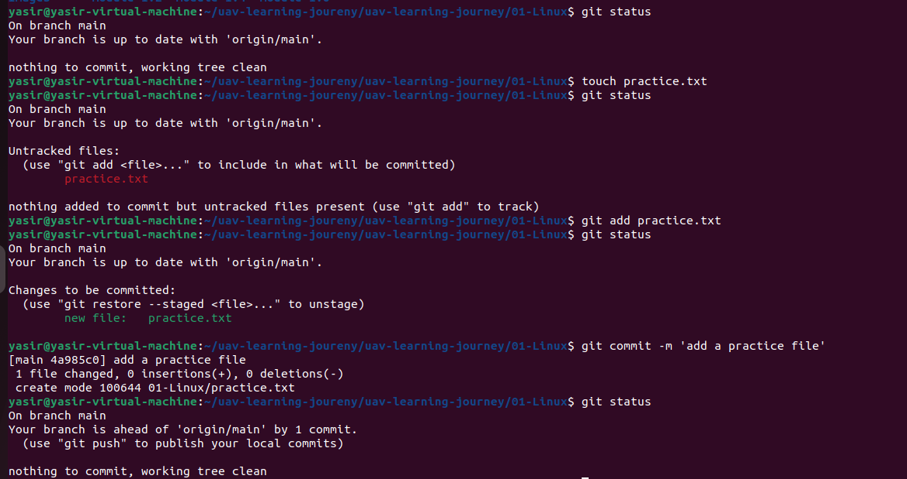

## Module 2.2: Git Workflow & Three Trees Architecture


To work effectively with Git, you must understand how files move through different stages of local tracking before they are permanently saved into your project's history.


---


### Core Structural Concepts


#### What is a repository?

A repository (or "repo") is your project's digital tracking folder. It contains all of the code, documentation, scripts, and asset files for your project, along with a complete historical record of every change ever made to them.


#### What is `.git`?

The `.git` folder is a hidden directory created automatically when you initialize a Git project. It is the actual "brain" of Git. It contains the database, object graphs, configuration profiles, and history tracking data that allow Git to manage your versions. If you delete this hidden folder, you lose your entire version history.


---


### The Three Local Spaces


Git manages your project files using three distinct architectural spaces:


1. **Working Directory:** This is the local folder on your computer where you can directly see, create, and edit your project files using an editor or IDE. Files here are either "untracked" or contain "unstaged modifications."

2. **Staging Area (Index):** A virtual preparation zone or "loading dock." It serves as a draft space where you collect, organize, and review changes that you want to include in your next official snapshot.

3. **Repository (Local):** The permanent database where Git permanently stores all your committed snapshots. Once changes reach this space, they are securely logged into the project's historical timeline.


---


### The Git Workflow Explained


The basic local Git workflow follows an iterative, three-step cycle:

1. **Modify:** You add, edit, or delete files inside your **Working Directory** (e.g., editing a drone controller parameter script).

2. **Stage:** You run `git add` to move your chosen modifications into the **Staging Area** to prepare them for saving.

3. **Commit:** You run `git commit` to permanently record the staged snapshot into your local **Repository** history with an explanatory message.


#### Why does Git use a Staging Area?

The staging area gives you **precision control**. Instead of forcing you to save *every single change* you made across twenty different files at once, the staging area lets you group related modifications together. 


For instance, if you fixed a bug in a telemetry script and *also* started drafting an unrelated documentation page, you can stage only the telemetry script and commit it cleanly, keeping your project history neat, modular, and easy to read.


---


### Hands-on Workflow Demo


Below is the execution sequence for checking tracking states, staging a new file, and committing it to the project history.


### Module 2.2 Summary

Today I learned about Git’s internal architectural layout, moving beyond simple commands to understand the relationship between the Working Directory, the Staging Area, and the Local Repository. I discovered that the hidden .git folder houses the entire historical record of a project. Practicing the core workflow sequence highlighted how the staging area acts as a vital review zone, giving me the flexibility to structure precise, clean code commits, which is a foundational requirement for securely managing production-grade robotics codebases.





```bash

# Navigate to the workspace

cd ~/uav-learning-journey


# Check the baseline state of the repository

git status


# Create an empty practice tracking file

touch practice.txt


# Verify that Git detects the new file as untracked

git status


# Move the file into the Staging Area

git add practice.txt


# Verify that the file is now green and staged for commitment

git status


# Permanently record the staged file into the repository history

git commit -m "Add practice file"


# Confirm that the working directory is completely clean

git status
